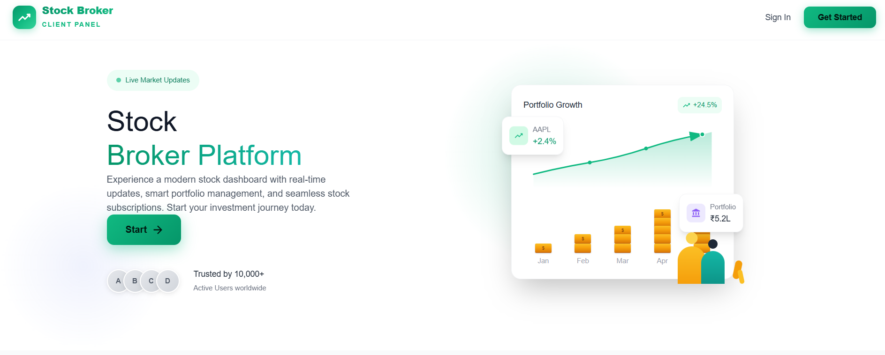
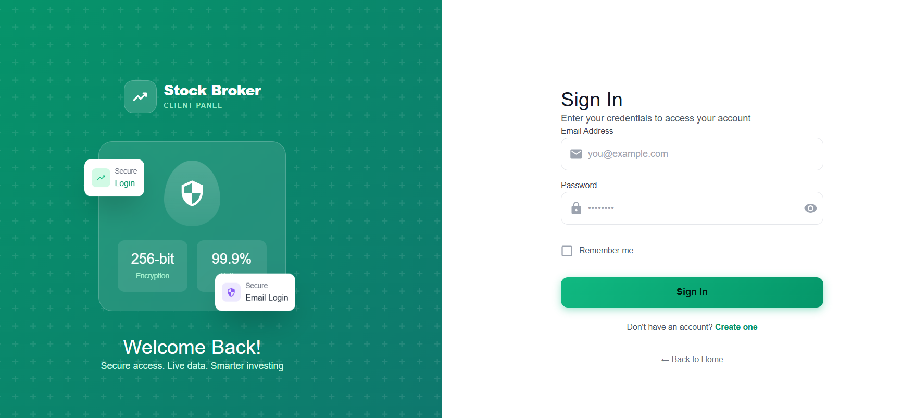
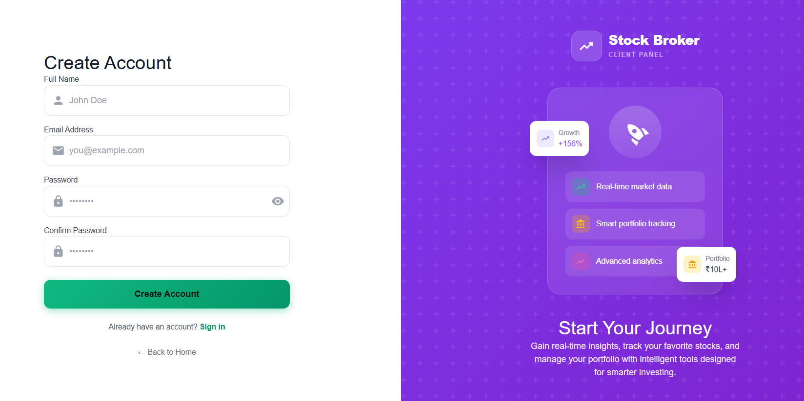
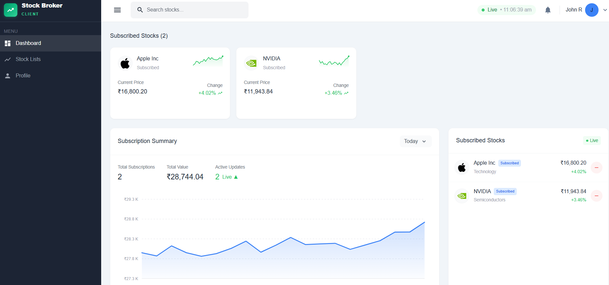

<div align="center">

# 📈 Stock Broker Client Web Dashboard

### A Modern Real-Time Stock Trading Platform

[](https://stock-broker-frontend.onrender.com)
[](https://stock-broker-client-web-dashboard.onrender.com)


<br/>

> **Track live stock prices • Manage your portfolio • Real-time WebSocket updates**

</div>

---

## 🌟 Overview

Stock Broker Client Web Dashboard is a full-stack web application that provides real-time stock market monitoring and portfolio management. Built with modern technologies, it offers a seamless trading experience with live price updates, beautiful visualizations, and secure authentication.

---

## ✨ Key Features

<table>
<tr>
<td width="50%">

### 📊 Real-Time Trading
- **Live Price Updates** via WebSocket
- **Interactive Charts** with Recharts
- **Multi-Stock Monitoring**
- **INR Currency Support**

</td>
<td width="50%">

### 🔐 Secure Platform
- **JWT Authentication**
- **Encrypted Passwords**
- **Protected Routes**
- **Session Management**

</td>
</tr>
<tr>
<td width="50%">

### 📱 Modern UI/UX
- **Dark Theme Interface**
- **Responsive Design**
- **Smooth Animations**
- **Material Design**

</td>
<td width="50%">

### 💼 Portfolio Tools
- **Stock Watchlist**
- **Subscription Management**
- **Price Alerts**
- **Performance Tracking**

</td>
</tr>
</table>

---

## 🖼️ Screenshots

### 🏠 Landing Page
*Welcome to the platform - Your gateway to smart investing*



---

### 🔐 Login Page
*Secure authentication with JWT tokens*



---

### 📝 Register Page
*Quick and easy account creation*



---

### 📊 Dashboard
*Real-time stock monitoring with interactive charts*



---

## 🛠️ Tech Stack

<div align="center">

### Frontend


### Backend


</div>

---

## 📊 Supported Stocks

<div align="center">

| Symbol | Company | Sector |
|:------:|---------|--------|
| 🍎 **AAPL** | Apple Inc. | Technology |
| 🔍 **GOOG** | Alphabet Inc. | Technology |
| ⚡ **TSLA** | Tesla Inc. | Automotive |
| 📦 **AMZN** | Amazon.com Inc. | E-Commerce |
| 👤 **META** | Meta Platforms Inc. | Social Media |
| 🎮 **NVDA** | NVIDIA Corporation | Semiconductors |
| 💻 **MSFT** | Microsoft Corporation | Technology |

</div>

---

## 🚀 Quick Start

### Prerequisites

```
Node.js >= 18.0.0  •  MongoDB Atlas Account  •  npm or yarn
```

### 1️⃣ Clone & Install

```bash
# Clone the repository
git clone https://github.com/Gouricse/Stock-Broker-Client-Web-Dashboard.git
cd Stock-Broker-Client-Web-Dashboard

# Install Backend dependencies
cd Backend && npm install

# Install Frontend dependencies
cd ../Frontend && npm install
```

### 2️⃣ Configure Environment

Create `.env` file in `Backend/` directory:

```env
PORT=5000
MONGODB_URI=your_mongodb_connection_string
JWT_SECRET=your_super_secret_key
FRONTEND_URL=http://localhost:5173
```

### 3️⃣ Run the Application

```bash
# Terminal 1 - Start Backend
cd Backend && npm run dev

# Terminal 2 - Start Frontend  
cd Frontend && npm run dev
```

### 4️⃣ Open in Browser

```
🌐 Frontend: http://localhost:5173
🔗 Backend API: http://localhost:5000
```

---

## 🔌 API Reference

### Authentication Endpoints

| Method | Endpoint | Description |
|:------:|----------|-------------|
| `POST` | `/api/auth/register` | Create new account |
| `POST` | `/api/auth/login` | User login |
| `POST` | `/api/auth/logout` | User logout |
| `GET` | `/api/auth/me` | Get current user |
| `GET` | `/api/auth/verify` | Verify token |
| `POST` | `/api/auth/refresh-token` | Refresh JWT |

### Stock Endpoints

| Method | Endpoint | Description |
|:------:|----------|-------------|
| `GET` | `/api/stocks` | Get all supported stocks |
| `GET` | `/api/stocks/subscribed` | Get user's subscribed stocks |
| `POST` | `/api/stocks/subscribe` | Subscribe to a stock |
| `POST` | `/api/stocks/unsubscribe` | Unsubscribe from a stock |

### WebSocket Events

| Event | Direction | Payload |
|-------|:---------:|---------|
| `all_prices_update` | ⬇️ Server → Client | `{ stocks: {...}, timestamp }` |
| `price_update` | ⬇️ Server → Client | `{ ticker, price, change, history }` |
| `update_subscriptions` | ⬆️ Client → Server | - |

---

## 🔒 Security Features

<div align="center">

| Feature | Implementation |
|---------|----------------|
| 🔑 **Authentication** | JWT with Access & Refresh Tokens |
| 🔐 **Password Security** | bcrypt Hashing |
| 🍪 **Cookie Protection** | HTTP-Only, Secure, SameSite |
| 🛡️ **CORS** | Configured Allowed Origins |
| 🚧 **Route Protection** | Client & Server-side Guards |

</div>

---

## 🌐 Deployment

### Live URLs

| Service | Platform | URL |
|---------|:--------:|-----|
| **Frontend** | Render | [stock-broker-frontend.onrender.com](https://stock-broker-frontend.onrender.com) |
| **Backend** | Render | [stock-broker-client-web-dashboard.onrender.com](https://stock-broker-client-web-dashboard.onrender.com) |
| **Database** | MongoDB Atlas | Cloud Hosted |

---

## 📜 License

This project is licensed under the **MIT License** - see the [LICENSE](LICENSE) file for details.

---

<div align="center">

## 👨‍💻 Author

**Gouri CSE**

[](https://github.com/Gouricse)

---

### 🌟 Star this repo if you found it helpful!

<br/>

Made with ❤️ and ☕ by **Gouri CSE**

</div>
